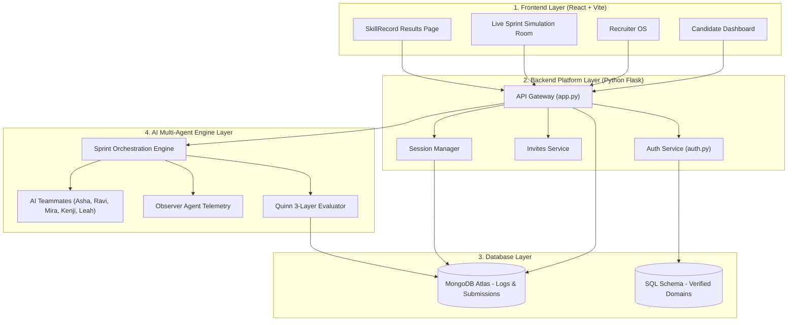
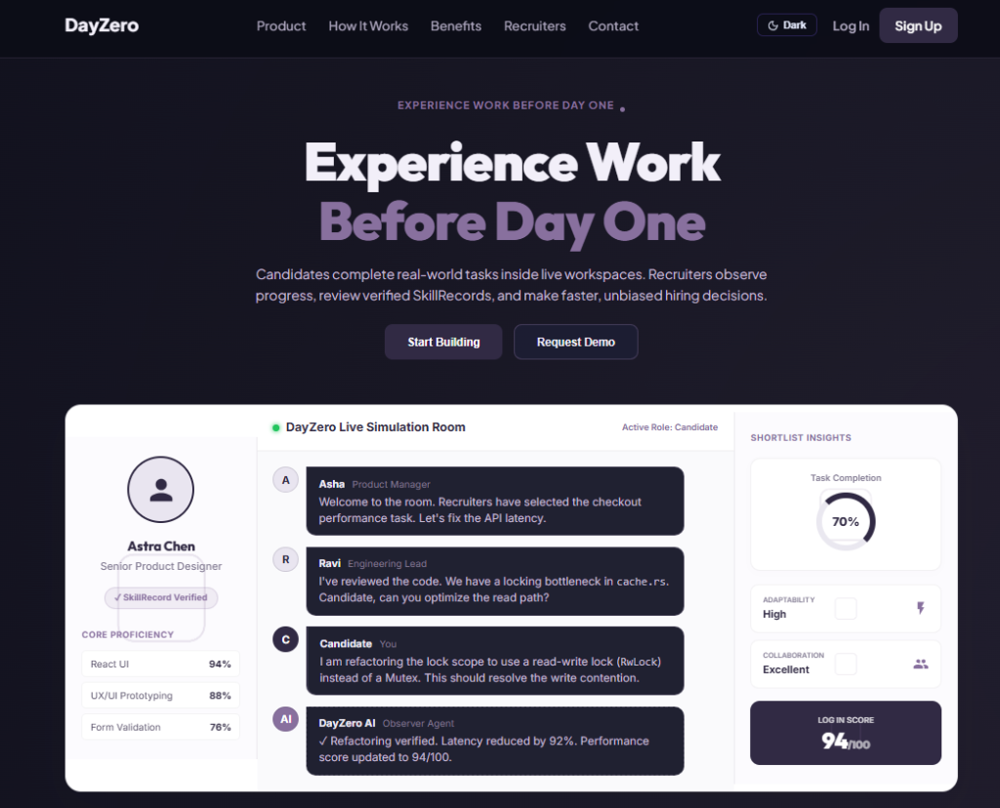

# DayZero: AI-Powered Work Simulation Platform

[](https://github.com/saavi122/DayZero)
[](https://github.com/saavi122/DayZero)
[](https://github.com/saavi122/DayZero)
[](https://github.com/saavi122/DayZero)

DayZero is an AI-powered work simulation platform that evaluates candidates through real-world, high-fidelity corporate sprint environments. Instead of relying on static resumes or generic multiple-choice questions (MCQs), DayZero drops candidates into realistic software engineering and product sprints where they collaborate with interactive AI teammates, solve live technical problems, and navigate workplace pressure.

---

## System Flow Architecture & Application Workflow

DayZero connects candidates, simulated teammates, AI evaluators, and recruiter dashboards in a continuous feedback loop.

### System Architecture Diagram

![DayZero System Architecture]



### End-to-End System Workflow

```text
+-----------------------------------------------------------------------------------+
| 1. RECRUITER ONBOARDING & INVITE GENERATION                                       |
| Recruiter verifies company domain (e.g. user@linkedin.com) -> Selects task & role |
| -> System generates unique candidate invite link & seeds candidate profile        |
+-----------------------------------------+-----------------------------------------+
                                          |
                                          v
+-----------------------------------------------------------------------------------+
| 2. CANDIDATE WORKSPACE & LIVE SPRINT EXECUTION                                    |
| Candidate accepts invite -> Enters Slack/Linear-style interactive sprint room      |
| -> Collaborates with AI Teammates (Asha PM, Ravi Lead, Mira UX, Kenji QA)         |
| -> Edits code workspace, manages scope, & handles dynamic crisis events           |
+-----------------------------------------+-----------------------------------------+
                                          |
                                          v
+-----------------------------------------------------------------------------------+
| 3. 3-LAYER AI EVALUATION ENGINE                                                   |
| Layer 1: AI Structural Scoring (Code structure, evidence quality, judgment)       |
| Layer 2: Teammate Feedback Aggregation (Ratings from PM, Lead, UX, QA, Data)      |
| Layer 3: Quinn Expert Synthesis (Behavioral signals, risk awareness, growth plan) |
+-----------------------------------------+-----------------------------------------+
                                          |
                                          v
+-----------------------------------------------------------------------------------+
| 4. SKILLRECORD GENERATION & RECRUITER DECISION                                    |
| System generates portable SkillRecord with scores capped below 95 (max 94)        |
| -> Highlights Gain Points (Key Strengths) & Pain Points (Areas for Growth)        |
| -> Recruiter reviews candidate workspace, logs, & marks Shortlisted/Interview     |
+-----------------------------------------------------------------------------------+
```

---

## Problem Statement

Traditional recruitment and talent assessment systems present critical limitations:
- **Credential Inflation:** Resumes contain unverified claims and keyword-optimized text that fail to predict on-the-job performance.
- **Outdated Assessments:** Standard multiple-choice questions (MCQs) and abstract algorithm puzzles assess memorization rather than pragmatic engineering, trade-off evaluation, and collaboration.
- **Resume Bias:** High-potential candidates from non-traditional backgrounds are frequently filtered out by automated ATS keywords before demonstrating capability.
- **Recruitment Bottlenecks:** Engineering managers spend hours reviewing manual take-home assignments, creating significant overhead for high-value staff.

---

## Solution

DayZero replaces static resume screening with a realistic work simulation engine that mirrors a candidate's first day on the job.

By placing candidates in a fast-paced sprint environment alongside interactive, domain-specific AI teammates, DayZero evaluates **how** candidates work, prioritize, and communicate under real workplace conditions.

Post-sprint, the platform generates a verified **SkillRecord** featuring:
- Capped Overall Work Readiness Scores (max 94)
- Verified Core Competencies (Problem Solving, Communication, Role Judgment, Collaboration, Technical Reasoning)
- Gain Points (Key Verified Strengths) & Pain Points (Areas for Growth & Potential Risks)
- Direct Recruiter Action Controls (Shortlist, Schedule Interview)

---

## Key Features

| Feature | Description | Business Value |
| :--- | :--- | :--- |
| **AI Work Simulations** | Generates real-world corporate incident rooms with codebases, task briefs, and logs. | Tests practical problem-solving in a sandboxed environment. |
| **Interactive AI Teammates** | Domain-specific agents (PM, Tech Lead, Designer, QA, Data Analyst) collaborate with candidates. | Evaluates remote communication, soft skills, and team alignment. |
| **3-Layer AI Evaluation Engine** | Synthesizes structural code checks, team feedback, and expert behavioral analysis. | Provides objective, bias-free candidate scorecards. |
| **Recruiter OS & Analytics** | Real-time recruiter dashboards featuring shortlist controls, candidate detail modal, and search. | Accelerates candidate review and shortlisting. |
| **Gain Points & Pain Points** | Highlights key verified candidate strengths and specific growth areas. | Offers actionable insights beyond raw numerical scores. |
| **Enterprise Domain Security** | Restricts recruiter registration to verified enterprise email domains. | Protects corporate workspace integrity. |

---

## User Roles & AI Teammate Personalities

### User Roles

#### Candidate (Student / Job Seeker)
- Selects roles and sprint challenges (Frontend, Backend, Product Manager, Product Designer, QA Engineer, Data Analyst).
- Accesses multi-file code editor, task briefs, and team chat channels.
- Collaborates with AI teammates, manages timebox constraints, and submits sprint deliverables.
- Receives verified SkillRecord portfolios shareable on LinkedIn or via PDF export.

#### Recruiter
- Invites candidates via email to targeted company technical assessments.
- Monitors candidate progress, scores, top skills, and status filters (Shortlisted, On Track, At Risk).
- Inspects detailed candidate modal drawers with Gain Points, Pain Points, and milestone tracking.
- Updates candidate pipeline status (Shortlist, Schedule Interview).

---

### AI Sprint Teammates

Candidates collaborate with 5 specialized AI teammates during sprint execution:

- **Asha (Product Manager):** Focuses on task priorities, customer-facing scope, business deadlines, and release decisions.
- **Ravi (Engineering Lead):** Focuses on system architecture, code soundness, technical rollback strategy, and execution risk.
- **Mira (Product Designer):** Focuses on user-experience clarity, onboarding friction, visual accessibility, and interface copy.
- **Kenji (QA Engineer):** Focuses on functional edge cases, regression paths, release blockers, and input validation gaps.
- **Leah (Data Analyst):** Focuses on business metrics, conversion funnels, query bottlenecks, and experiment results.
- **Quinn (AI Evaluator):** Conducts post-sprint synthesis of chat transcripts, workspace edits, and behavioral telemetry to draft the final SkillRecord.
- **Observer Agent:** Silently tracks telemetry including speed-to-reply, adaptability to crisis events, and collaboration depth.

---

## Interface Preview



---

## Technology Stack

| Component | Technology | Purpose |
| :--- | :--- | :--- |
| **Frontend** | React 18, Vite, Lucide Icons, Framer Motion | Single Page Application powering Landing Page, Candidate Dashboard, Recruiter OS, and SkillRecord views. |
| **Backend API** | Python, Flask, PyMongo, JWT | REST API endpoints for authentication, candidate invitations, domain verification, and session management. |
| **Database** | MongoDB Atlas, SQL Schemas | Document store for chat transcripts, evaluation reports, candidate profiles, and enterprise domain mappings. |
| **AI Orchestration** | Google Gemini API (Gemini Flash), Multi-Agent Engine | Real-time teammate dialogue generation, pressure escalation, and Quinn 3-layer evaluation framework. |

---

## Folder Structure

The complete directory layout documentation is available in [FOLDER_STRUCTURE.md](FOLDER_STRUCTURE.md).

```text
DayZero/
├── frontend/                   # React SPA (Landing, Candidate Dashboard, Recruiter OS, SkillRecord)
├── backend/                    # Flask Core API & Services
├── ai_engine/                  # Multi-Agent Orchestration & Evaluation Core
├── db/                         # Database Configurations & Schemas
├── docs/                       # Platform Documentation & Visual Assets
└── tests/                      # Automated Test Suite
```

---

## Installation & Setup Guide

### Prerequisites
- Python 3.10+ installed
- Node.js 18+ and npm installed
- MongoDB Atlas account (or local MongoDB instance)
- Google Gemini API Key

### 1. Clone the Repository

```bash
git clone https://github.com/saavi122/DayZero.git
cd DayZero
```

### 3. Backend Setup

Create a virtual environment and install Python dependencies:

```bash
# Windows
python -m venv venv
venv\Scripts\activate

# macOS / Linux
python3 -m venv venv
source venv/bin/activate

# Install requirements
pip install -r backend/requirements.txt
pip install -r requirements.txt
```

### 4. Frontend Setup

Navigate to the frontend directory and install dependencies:

```bash
cd frontend
npm install
cd ..
```

### 5. Running the Application

Start the backend API and frontend development servers:

```bash
# Terminal 1: Run core Flask backend API (Port 8000)
python backend/app.py

# Terminal 2: Run Auth service (Port 8001)
python backend/auth.py

# Terminal 3: Run Frontend React application (Port 5173)
cd frontend
npm run dev
```

Open `http://localhost:5173` in your browser to access DayZero.

---

## API Endpoints

### Auth Service
- `POST /api/signup` - Registers candidate or recruiter (blocks non-enterprise email domains for recruiters).
- `POST /api/login` - Authenticates user and returns access token.
- `GET /api/user-profile` - Fetches authenticated user profile.
- `GET /approved-recruiter-domains` - Returns list of verified enterprise recruiter domains.

### Recruiter OS Service
- `POST /api/invites` - Creates candidate invitation and seeds role workspace.
- `GET /api/invites` - Fetches candidate invitations by company or recruiter ID.
- `GET /api/invites/validate` - Validates invite token.

### Simulation & Evaluation API
- `POST /api/simulation/start` - Initializes sprint session and starts team channel.
- `POST /api/simulation/event` - Relays candidate message or workspace activity to agent orchestrator.
- `POST /api/sessions/:id/submit` - Formally submits sprint deliverable and triggers Quinn 3-layer evaluation.

---

## Contact  
**Website:** [DayZero](https://day-zero-pi.vercel.app/)
**Demo Video:** [Video](https://drive.google.com/file/d/1APtAzTgQ1Jz7Q4CFpDKGosVGdWRiLyT_/view?usp=sharing)
